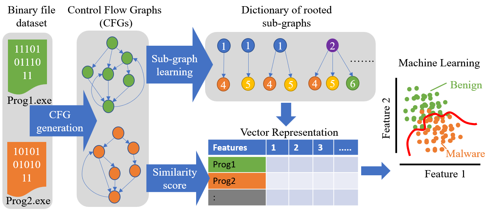

# Binary file analysis using Graph2Vec and unsupervised clustering

A stable reproducible capsule is available at "https://codeocean.com/capsule/6978226/tree"

The repository contains 'main.py' programs for
1. Creating Control Flow Graphs (CFG) from binary files using 'angr' package.
2. Create vector representation for CFGs using 'Graph2Vec' graph embedding.
3. Unsupervised clustering algorithm training with hold out validation.
4. Cluster prediction for Test dataset

## Dataset

### Introduction
Detecting malware from binary files is an important task in the research and development of the fields of cybersecurity 
and machine learning. This dataset was curated to assess the viability of unsupervised machine learning clustering 
techniques to identify differences between graph representations of benign software and malware. 

The dataset contains Control Flow Graphs benign and malicious programs. The dataset consists of benign operating system 
files as well as malware provided by Hoplite industries(https://www.hopliteindustries.com).

The binary files are first converted into a control flow graph (CFG) representation. This is carried out by the 
CFGEmulated() function of the "angr" Python library.

Due to the security risk of sharing Malware binary files online. These binary files 
are not shared. However, the hash values of the binaries are given for information. 

Dataset is permanently archived at the following link.

'https://doi.org/10.5281/zenodo.7630371'

### Composition

Datasets composition is as follows 

|       | Malware | Benign |
| ------|---------|--------|
| Train | 3000    | 3000   |
| Test  | 1000    | 1000   |

Types of Malware according to VIRUSTOTAL are given in the following table. 

| **Type**          | **Train** | **Test** | **Type**    | **Train** | **Test** |
|-------------------|-----------|----------|-------------|-----------|----------|
| adware            | 443       | 163      | krypt       | 1         | 0        |
| artemis           | 1         | 1        | kryptik     | 1         | 1        |
| banker            | 3         | 1        | midgare     | 0         | 1        |
| bechiro           | 0         | 1        | morstar     | 3         | 3        |
| bundler           | 1         | 1        | pua         | 5         | 2        |
| bundlore          | 3         | 1        | qakbot      | 1         | 0        |
| casino            | 1         | 0        | ransomware  | 2         | 0        |
| cinmus            | 1         | 0        | sefnit      | 1         | 0        |
| dialer            | 0         | 1        | softpulse   | 3         | 1        |
| domaiq            | 8         | 3        | solimba     | 8         | 4        |
| downloader        | 44        | 16       | squarenet   | 1         | 0        |
| dropper           | 2         | 10       | suspect     | 1         | 0        |
| fakeav            | 0         | 2        | symmi       | 1         | 0        |
| eurezo            | 1         | 0        | susppack    | 0         | 1        |
| file              | 1         | 0        | trojan      | 1792      | 652      |
| firseria          | 2         | 1        | ulpm        | 1         | 0        |
| firseriainstaller | 4         | 0        | unwanted    | 1         | 0        |
| hacktool          | 5         | 0        | virus       | 114       | 49       |
| installcore       | 5         | 2        | worm        | 202       | 68       |
| installerex       | 1         | 0        | Unspecified | 333       | 23       |
| kazy              | 2         | 0        |             |           |          |

### Structure

- Train_CFG
  - Benign_CFG
    - *.gpickle (x 3000)
  - Malware_CFG
    - *.gpickle (x 3000)
  - mal_hashes_train.txt  (malware hash values for train set)
- Test_CFG
  - Benign_CFG
    - *.gpickle (x 1000)
  - Malware_CFG
    - *.gpickle (x 1000)
  - mal_hashes_test.txt (malware hash values for test set)
- mal_hashes.txt (malware hash values)
- class_labels_no_dupes.txt (class labels for benign and malware)

### Usage
The experiments showing curating and reading the dataset can be found at 
"https://github.com/MSUSEL/unsupervised-graph/tree/main/Unsupervised%20clustering%20of%20CFG%20Files"

A stable reproducible capsule is available at "https://codeocean.com/capsule/6978226/tree"

 
